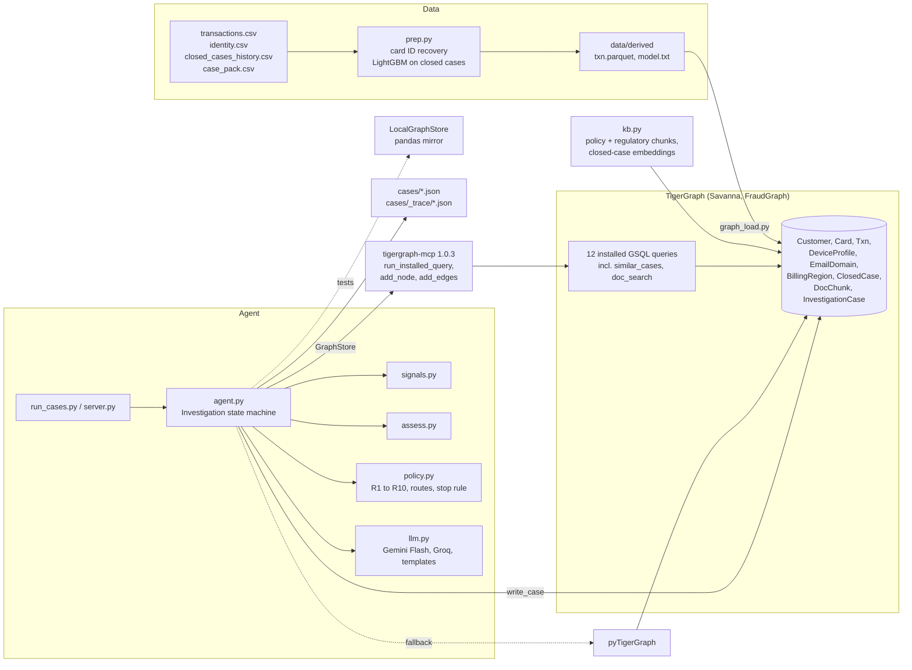

# FraudGraph agent

An investigation agent for the TigerGraph Hacker House Goa 2026 task (Agentic Fraud Investigation). It takes an alert from the case pack, investigates it against a TigerGraph graph of 590,742 card transactions and 5,565 closed cases, decides what kind of fraud it is and how far it goes, and recommends next best actions under Fraud Policy v1.0. For each of the 20 cases it writes an answer file to `cases/`, a step trace to `cases/_trace/`, and an `InvestigationCase` vertex back into the graph so later investigations can retrieve it.

Built in one evening. The decision core is deterministic Python; the LLM writes prose and never overrides policy.

## Architecture



Investigation flow per case: trigger, open case vertex, gather graph evidence, extract signals, retrieve similar cases and policy text (GraphRAG), assess probability and pattern, initial next best action, request evidence if uncertain, simulate the reply, reassess, final next best action, explain, write the case to the graph.

## Repo layout

```
fraudagent/
  agent.py        Investigation state machine, recommendation logic, templates
  signals.py      evidence gathering over the GraphStore, 11 signal extractors, episode builder
  assess.py       log-odds probability, independent evidence groups, pattern selection, exposure
  policy.py       Fraud Policy v1.0 as code: actions, approval routes, SAR rule (3a), stopping rule (6)
  llm.py          Gemini Flash primary, Groq fallback, None when both are unavailable
  embed.py        deterministic 256-dim feature-hashing embeddings
  kb.py           builds DocChunk vertices and ClosedCase embeddings
  prep.py         derived transaction table, card ID recovery, LightGBM model
  graphstore.py   GraphStore interface and LocalGraphStore (pandas)
  tg_store.py     TigerGraphStore over tigergraph-mcp or pyTigerGraph
  tg_mcp.py       synchronous stdio client for the tigergraph-mcp server
  graph_load.py   schema, bulk load, query install, stats
  run_cases.py    runs the 20 cases and writes cases/
  server.py       analyst case workbench (FastAPI)
graph/
  schema.gsql     FraudGraph schema (local types)
  queries/*.gsql  installed queries
docs/kb/          policy, pattern and regulatory notes loaded as DocChunk vertices
docs/             blog post, demo script, social posts
cases/            the 20 answer files, plus _trace/ step traces
tests/            GraphStore, MCP parsing and loader tests
web/              workbench front end
```

## Setup

```bash
python -m venv .venv
source .venv/bin/activate
pip install -r requirements.txt
cp .env.example .env
```

`.env`:

| Key | Value |
|---|---|
| `TG_HOST` | Savanna workspace URL, e.g. `https://<workspace>.i.tgcloud.io` |
| `TG_SECRET` | graph secret for the workspace |
| `TG_GRAPHNAME` | `FraudGraph` |
| `TG_TGCLOUD` | `true` |
| `GEMINI_API_KEY` | optional, free tier |
| `GROQ_API_KEY` | optional, free tier |

`.env` and `data/` are gitignored. Keep secrets there, not in code.

Put the four provided files in `data/`: `transactions.csv`, `identity.csv`, `closed_cases_history.csv`, `case_pack.csv`. The loader and agent read `data/derived/` (`txn.parquet`, `closed_cases.parquet`, `model.txt`). Run `python -m fraudagent.prep` only if you are rebuilding the derived data; it reads the 708 MB transactions file, recovers card IDs and retrains the model.

## Load TigerGraph

```bash
python -m fraudagent.graph_load schema    # create FraudGraph and run the schema change job
python -m fraudagent.graph_load load      # upsert vertices and edges (--only, --chunk, --workers)
python -m fraudagent.graph_load queries   # create and install graph/queries/*.gsql
python -m fraudagent.graph_load stats     # vertex and edge counts
```

The loaded graph has 590,742 `Txn` vertices and about 3.1M vertices plus edges. Query install on Savanna takes several minutes.

## Build the knowledge base

```bash
python -m fraudagent.kb --backend mcp
```

Chunks `docs/kb/*.md` by section into `DocChunk` vertices and writes an embedding onto every `ClosedCase` vertex.

## Run the 20 cases

```bash
python -m fraudagent.run_cases --backend mcp          # or --backend pytg, --backend local
python -m fraudagent.run_cases --backend mcp --only HHG-006,HHG-014
```

Cases run in `opened_at` order, so each written `InvestigationCase` is available to the cases after it. One line per case is printed; answer files go to `cases/`, traces to `cases/_trace/`.

Tests run on the local mirror: `pytest tests/`.

## Run the UI

Analyst case workbench at http://127.0.0.1:8000:

```bash
python -m fraudagent.server                     # FRAUD_BACKEND=mcp to run against TigerGraph
```

It shows the case queue, the investigation timeline streamed live, initial versus final next best action with approval routes, the evidence table, a network view, the SAR panel and case memory.

## Results

Generated from `cases/*.json`, produced by `python -m fraudagent.run_cases --backend mcp` against the Savanna workspace (all graph reads and case write-backs through TigerGraph MCP). The local pandas backend gives identical decisions. Totals: 10 fraud, 8 legitimate, 2 uncertain; 5 suspicious activity reports; 10 cases where an evidence request changed the recommendation between initial and final.

| Case | Trigger | Verdict | p(fraud) | Pattern | Exposure | SAR | Final actions (route) |
|---|---|---|---|---|---|---|---|
| HHG-001 | risk_score | legitimate | 0.05 | none | $0.00 | no | CREATE_CASE (auto), ALLOW_TRANSACTION (auto), CLOSE_NO_FRAUD (auto) |
| HHG-002 | risk_score | fraud | 0.88 | card_not_present_fraud | $292.36 | no | BLOCK_CARD (L1), CREATE_CASE (auto) |
| HHG-003 | customer_report | fraud | 0.83 | out_of_region_use | $165.93 | no | BLOCK_CARD (L1), CREATE_CASE (auto) |
| HHG-004 | customer_report | fraud | 0.71 | card_not_present_new_device | $128.33 | no | BLOCK_CARD (L1), CREATE_CASE (auto) |
| HHG-005 | risk_score | legitimate | 0.05 | none | $0.00 | no | CREATE_CASE (auto), ALLOW_TRANSACTION (auto), CLOSE_NO_FRAUD (auto) |
| HHG-006 | customer_report | fraud | 0.98 | undocumented | $1,906.07 | yes | BLOCK_CARD (L1), CREATE_CASE (auto), FILE_REPORT (L2), MONITOR_CONNECTED_CARDS (auto), ESCALATE_TO_ANALYST (auto) |
| HHG-007 | risk_score | fraud | 0.92 | account_takeover | $148.89 | no | BLOCK_CARD (L1), CREATE_CASE (auto) |
| HHG-008 | customer_report | fraud | 0.98 | card_not_present_fraud | $166.97 | no | BLOCK_CARD (L1), CREATE_CASE (auto) |
| HHG-009 | customer_report | fraud | 0.98 | card_not_present_fraud | $30.02 | no | BLOCK_CARD (L1), CREATE_CASE (auto) |
| HHG-010 | risk_score | uncertain | 0.43 | card_not_present_new_device | $1,000.03 | no | DECLINE_TRANSACTION (L1), CREATE_CASE (auto), MONITOR_CARD (auto), ESCALATE_TO_ANALYST (auto) |
| HHG-011 | customer_report | fraud | 0.98 | card_not_present_new_device | $131.30 | yes | BLOCK_CARD (L1), CREATE_CASE (auto), FILE_REPORT (L2), MONITOR_CONNECTED_CARDS (auto) |
| HHG-012 | risk_score | legitimate | 0.02 | none | $0.00 | no | ALLOW_TRANSACTION (auto), CLOSE_NO_FRAUD (auto) |
| HHG-013 | risk_score | legitimate | 0.05 | none | $0.00 | no | CREATE_CASE (auto), ALLOW_TRANSACTION (auto), CLOSE_NO_FRAUD (auto) |
| HHG-014 | analyst_request | fraud | 0.92 | undocumented | $74.96 | yes | BLOCK_CARD (L1), CREATE_CASE (auto), FILE_REPORT (L2), MONITOR_CONNECTED_CARDS (auto), ESCALATE_TO_ANALYST (auto) |
| HHG-015 | risk_score | legitimate | 0.05 | none | $0.00 | no | CREATE_CASE (auto), ALLOW_TRANSACTION (auto), CLOSE_NO_FRAUD (auto) |
| HHG-016 | customer_report | fraud | 0.98 | card_not_present_new_device | $59.67 | no | BLOCK_CARD (L1), CREATE_CASE (auto) |
| HHG-017 | risk_score | uncertain | 0.34 | card_not_present_fraud | $300.14 | no | DECLINE_TRANSACTION (L1), CREATE_CASE (auto), MONITOR_CARD (auto) |
| HHG-018 | customer_report | legitimate | 0.05 | none | $0.00 | no | CREATE_CASE (auto), WARN_CUSTOMER (auto), CLOSE_NO_FRAUD (auto) |
| HHG-019 | risk_score | fraud | 0.98 | card_not_present_new_device | $99.92 | yes | BLOCK_CARD (L1), CREATE_CASE (auto), FILE_REPORT (L2), MONITOR_CONNECTED_CARDS (auto) |
| HHG-020 | risk_score | legitimate | 0.05 | none | $0.00 | no | CREATE_CASE (auto), ALLOW_TRANSACTION (auto), CLOSE_NO_FRAUD (auto) |

10 fraud, 8 legitimate, 2 uncertain (escalated or open after no reply, R4), 5 SARs, 10 cases with an evidence request whose initial and final actions differ.

## Design decisions

- **Own model instead of the bank score.** LightGBM trained only on the closed cases (July to October: 4,665 confirmed fraud, 900 cleared, plus 120k unlabeled July to October transactions as negatives). On the October hold-out it reaches ROC AUC 0.96 overall and 0.88 separating confirmed fraud from cleared false alarms; the bank `risk_score` scores 0.05 on that same split. The model score is the prior; signals add log-odds on top.
- **Deterministic decisions, LLM for prose.** Probability, pattern, actions, routes and the SAR decision come from `assess.py` and `policy.py`, so every action cites a rule and a query. The LLM (Gemini Flash, then Groq, then templates) writes the summary, SAR narrative and a critique that goes into the trace only.
- **Independent evidence groups.** Signals are tagged `sequence`, `device`, `network`, `behaviour`, `region`, `identity`, `memory`, `customer` or `model`. The stopping rule (policy section 6) needs two distinct groups, not two signals from the same query.
- **Device specificity filter.** A device profile counts as a link between cards only if it is specific (a model string, or both OS and screen known) and used by 60 cards or fewer in the window. Generic profiles such as `Trident/7.0 | Windows 7 | ie 11.0 for desktop | 1920x1080` connect dozens of unrelated cards.
- **Undocumented patterns as code.** Threshold structuring (three or more online purchases within an hour just under a round limit) and the proxy device ring are detected explicitly and reported as `undocumented` with a description, under R9.
- **One GraphStore interface, three backends.** MCP, pyTigerGraph and a pandas mirror return the same shapes, which keeps the tests offline. If `similar_cases` or `doc_search` fail to install, `tg_store.py` falls back to `embeddings_dump` plus client-side cosine.
- **Denormalised Txn.** `card_id`, `customer_id` and `device_id` sit on `Txn` next to the edges, so per-card and per-device grouping needs one hop less.
- **Policy enforcement.** `policy.execute()` runs only `auto` actions; L1 and L2 actions are returned as pending approval.

## Limitations

- **Card ID recovery is a heuristic.** `transactions.csv` has no card ID. Card IDs are recovered from the closed cases and the case pack; unlabeled transactions are assigned by the customer's card attribute tuple (`card2` to `card6`), then the customer's most frequent labeled card, then `<customer>-K1`.
- **Customer and step-up replies are simulated** (policy section 5). The simulator returns a denial when the pre-reply probability is at least 0.5 and a confirmation otherwise, and recurring disputed charges are confirmed. The final outcome of every verified case is only as good as that pre-reply probability. Each assumption is recorded in `evidence_requests`.
- **Customers aggregate many cardholders.** A single customer ID in this dataset spans many underlying cards (HHG-018's card has 19 confirmed and 1 cleared prior cases), so per-card baselines for amount, region and device are noisy.
- **Hashed embeddings are lexical, not semantic.** Similar-case retrieval matches words such as "just under $500" or "anonymous proxy", not meaning. No model download is needed and vectors are reproducible.
- **Exposure is scoped to the investigated card.** The episode is the flagged transaction plus linked suspicious transactions on the same card within 48 hours. For the SM-G935F ring (HHG-014) the connected cards are listed and monitored, but their amounts are not in `exposure_usd`.
- **GSQL is written for TigerGraph 4.x** (Savanna). Earlier versions are untested.
