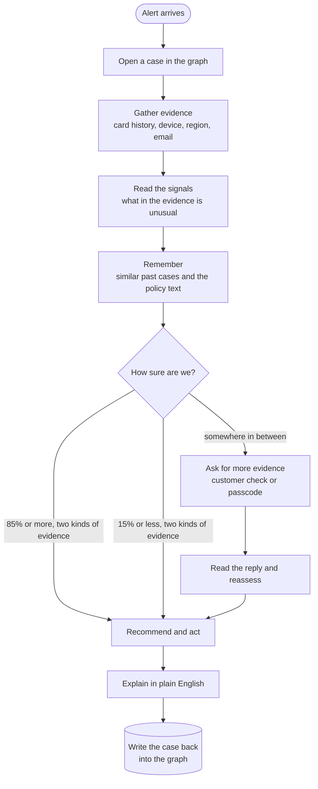
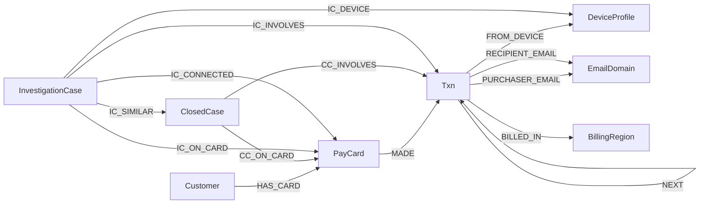
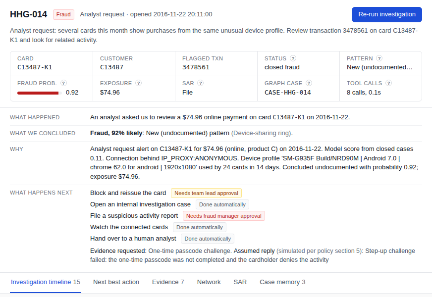

# FraudGraph

**A fraud investigator that reads a bank's transaction graph, works a case the way an analyst would, and writes down every step.**

Built on TigerGraph for the Hacker House Goa 2026 challenge, *Agentic Fraud Investigation and Next Best Action*.

<p>
  
  
  
  
</p>

---

## Contents

1. [The short version](#the-short-version)
2. [One case, start to finish](#one-case-start-to-finish)
3. [What the agent does, step by step](#what-the-agent-does-step-by-step)
4. [How TigerGraph is used](#how-tigergraph-is-used)
5. [How a decision gets made](#how-a-decision-gets-made)
6. [What we found in the data](#what-we-found-in-the-data)
7. [Results on the 20 cases](#results-on-the-20-cases)
8. [The workbench](#the-workbench)
9. [Running it yourself](#running-it-yourself)
10. [Where things live](#where-things-live)
11. [What we are honest about](#what-we-are-honest-about)
12. [Questions people ask](#questions-people-ask)

---

## The short version

A bank's fraud model fires an alert. Someone has to decide what it means. Is this card stolen? Is it one bad transaction or part of something bigger? Should the card be blocked, or should somebody just call the customer?

Today that someone is an analyst with six browser tabs open. FraudGraph does the same job in under a minute and leaves a paper trail an auditor can follow.

For every alert it:

- **pulls the evidence out of a graph**: the card's history, the device it came from, the region it was billed in, and every other card that touched the same device or showed the same shape;
- **weighs that evidence** with a model trained on the bank's own closed cases, not the bank's alert score;
- **decides whether it knows enough.** If it doesn't, it asks the customer or triggers a one-time passcode before touching the card;
- **recommends actions under the bank's written policy**, with the rule number and who has to approve each one;
- **writes the case back into the graph**, so the next investigation can find it.

The decisions are made by code you can read. The language model only writes the summary and the regulator's report, and it never gets to change a verdict.

---

## One case, start to finish

The easiest way to understand the project is to watch it work one case. This is **HHG-014**, straight from the benchmark.

> **The alert.** An analyst writes: *"Several cards this month show purchases from the same unusual device profile. Review transaction 3478561 on card C13487-K1 and look for related activity."*

On its own, transaction 3478561 looks boring. It is a $74.96 online purchase, and the bank's model scored it **0.05** (almost certainly fine). Our own model, trained on past cases, gives it **0.11**. If you only looked at this card, you would close the alert and move on.

So the agent looks around it instead.

**1. It asks the graph who else used this device.** The purchase came from a Samsung SM-G935F running Chrome 62 on Android 7.0, behind an *anonymous* proxy. One query walks from the transaction to its device and back out to every transaction on that device over two weeks. The answer is **24 different cards**, **23 of them behind the same anonymous proxy**, and **47 confirmed fraud cases** already on file against those cards.

**2. It checks whether that link means anything.** Plenty of devices are shared innocently. "Windows, Chrome 66" is used by thousands of people. The agent only trusts a shared device when the profile is specific (a real model number, or a known OS and screen) and used by fewer than 60 cards. This one passes both tests.

**3. It recognises what it is looking at, and what it isn't.** None of the five fraud patterns in the bank's playbook describes one device working two dozen strangers' cards through a proxy. The agent labels it **undocumented** and describes it in plain words, which is what policy rule R9 asks for.

**4. It knows it isn't sure yet.** The probability is now 0.66. That's suspicious, but the policy (rule R1) says you don't block a card below 0.70 without checking with the cardholder first. So the agent's **first recommendation** is gentle: ask for a one-time passcode, contact the customer, open a case, raise monitoring, and flag it for an analyst. It blocks nothing.

**5. The reply comes back.** The dataset doesn't include real customer replies, so the policy tells us to simulate one and write down what we assumed. Here the assumed reply is that the passcode wasn't completed and the cardholder denies the purchase. The probability moves to **0.92**.

**6. Now it acts, and it says who has to sign off.**

| Action | Who approves | Why |
|---|---|---|
| Block and reissue the card | Team lead (L1) | R2: cardholder denied, $74.96 is under the $2,500 L1 limit |
| Open an internal fraud case | Automatic | R2 and section 3a |
| File a suspicious activity report | Fraud manager (L2) | R6 shared device, R9 undocumented pattern |
| Monitor the 23 connected cards | Automatic | R6: every card on the shared device |
| Hand to a human analyst | Automatic | R9: a new pattern deserves human eyes |

**7. It writes everything down.** The answer file holds the verdict, the evidence with the exact query behind each claim, the before-and-after recommendations and a regulator-ready report. The case also goes into TigerGraph as an `InvestigationCase` vertex, linked to the card, the transaction, the device and the most similar past cases. The next investigation that touches this device will find it.

That is the whole idea. A single card said nothing, and the graph said a lot.

---

## What the agent does, step by step

Every case follows the same path. Each step is logged, and the workbench replays it live.



In words:

| Step | What happens | Where in the code |
|---|---|---|
| **Trigger** | The alert comes in from a risk score, a customer complaint or an analyst. | `agent.py` |
| **Open case** | A case vertex is written to TigerGraph straight away, with status *open*. | `tg_store.write_case` |
| **Gather** | Graph queries fetch the card's recent window, its history, the device neighbourhood and the region. | `signals.gather` |
| **Signals** | Fourteen checks look for things that are out of place, such as small test charges before a big one, amounts just under a limit, a brand-new device, a proxy, or a device shared with risky cards. | `signals.extract` |
| **Second hop** | When the shape of the activity is suspicious, the same shape is searched for across every card in the graph. | `signals.expand` |
| **Memory** | Vector search inside TigerGraph returns the most similar closed cases and the relevant policy paragraphs. | `similar_cases`, `doc_search` |
| **Assess** | The signals are turned into one probability and a named pattern. | `assess.py` |
| **Recommend** | The policy engine picks actions, attaches rule numbers and approval routes. | `policy.py` |
| **Request** | If the case is uncertain, the agent asks for a customer check or a passcode and records the assumed reply. | `agent.simulate_response` |
| **Explain** | The language model writes the summary and the regulator's narrative from the evidence packet. | `llm.py` |
| **Write back** | The final case, with its links, goes into the graph as memory. | `tg_store.write_case` |

**When does it stop?** The bank's policy (section 6) gives three conditions: the probability is at or above 0.85 or at or below 0.15 with at least two *independent* kinds of evidence, a verification reply settles the question, or more digging would not change the decision. The agent checks these after every assessment and writes its reason into `stop_reason`.

"Independent" matters. Two facts that came out of the same query are really one piece of evidence. Every signal carries a group (sequence, device, network, behaviour, region, identity, customer or model), and the stopping rule counts groups, not signals.

---

## How TigerGraph is used

TigerGraph is the investigation surface itself. Everything the agent knows arrives through graph queries, and everything it concludes goes back into the graph.

### The graph



| Vertex | How many | What it is |
|---|---:|---|
| `Txn` | 590,742 | One card transaction, with amount, time, channel, region, device, our model score and the bank's score |
| `PayCard` | 13,579 | A card. Named `PayCard` because the Savanna starter workspace already owns a global `Card` type |
| `Customer` | 13,553 | The cardholder |
| `DeviceProfile` | 9,706 | Device model, OS, browser and screen, glued into one fingerprint |
| `BillingRegion` | 332 | The billing region code (`addr1`) |
| `EmailDomain` | 60 | Purchaser and recipient email domains |
| `ClosedCase` | 5,565 | The bank's finished investigations, each with an embedding for similarity search |
| `DocChunk` | 24 | Paragraphs of the fraud policy, the pattern playbook and regulatory notes, embedded |
| `InvestigationCase` | grows | The agent's own cases: its memory |

Roughly 3.1 million vertices and edges in total. A full load takes about five minutes.

### The queries

All reasoning over the graph happens in twelve installed GSQL queries. The agent never pulls raw tables.

| Query | The question it answers |
|---|---|
| `card_window` | What did this card do in the hours around the alert? |
| `card_baseline` | What is normal for this card: usual regions, products, devices, amounts? |
| `device_neighbors` | Who else used this device, and do any of those cards have fraud on file? |
| `region_activity` | Are other risky cards being used in this billing region right now? |
| `email_neighbors` | Are other risky cards sending to this recipient email domain? |
| `amount_band_scan` | Which cards show the same "just under the limit" shape this month? |
| `device_ring` | Which devices are shared by suspiciously many cards in a window? |
| `card_community` | Starting from one card, how far does the device-sharing web spread? |
| `card_cases` | What past cases, the bank's and ours, touch this card? |
| `similar_cases` | Which past cases read most like this one? Cosine similarity runs inside GSQL. |
| `doc_search` | Which policy paragraphs apply here? Also cosine inside GSQL. |
| `embeddings_dump` | Fallback: hand back the vectors if in-graph similarity is unavailable |

### TigerGraph MCP

The agent reaches the graph through the official **TigerGraph MCP server** (`tigergraph-mcp`). Reads are `tigergraph__run_installed_query` calls, and case write-back uses `tigergraph__add_node` and `tigergraph__add_edges`. The same interface also runs over pyTigerGraph directly, and over a small pandas mirror used for offline tests. All three return identical shapes, so the agent code never knows which one it is talking to.

### GraphRAG

When the language model writes a summary, it doesn't get raw rows. It gets a packet assembled from the graph: the facts each query established, the three most similar closed cases (found by vector search inside TigerGraph), and the policy paragraphs that apply (also found in the graph). It is told to use only the IDs, amounts and dates in that packet.

---

## How a decision gets made

### A model trained on what actually happened

Every transaction arrives with the bank's `risk_score`. We tested it against the bank's own closed cases and found that **it points the wrong way exactly where it matters**. When separating confirmed fraud from cleared false alarms, the bank score reaches an AUC of 0.05. That is worse than a coin flip, because its highest scores *are* the false alarms.

So we trained our own LightGBM model on the 5,565 closed cases from July to October, plus 120,000 ordinary transactions from the same months. On an October hold-out it reaches:

| | Our model | Bank risk score |
|---|---:|---:|
| Fraud vs everything (ROC AUC) | **0.96** | 0.86 |
| Fraud vs cleared false alarms (ROC AUC) | **0.88** | 0.05 |

The model's score is the starting point, never the verdict.

### Signals push the probability up or down

Each signal the agent finds adds or subtracts a fixed amount on the log-odds scale. A clean card-testing sequence pushes hard. A new device pushes a little. A charge that matches the customer's own monthly subscription pulls down. A customer denial is direct evidence and shifts the balance under rule R2.

The result is one number between 0.02 and 0.98. The model never says "100%".

### The policy is code, not a prompt

The bank's Fraud Policy v1.0 lives in `policy.py`: its fourteen actions, its three approval routes, rules R1 to R10, the case-versus-report rule and the stopping rule. The agent can only *execute* actions routed `auto`. Anything marked L1 or L2 is recorded as a recommendation waiting for a human, and the explanation says so.

| Route | Who | Examples |
|---|---|---|
| `auto` | The agent | Open a case, verify with the customer, passcode check, monitor, escalate |
| `L1` | Team lead | Decline a transaction, block a card with up to $2,500 exposed |
| `L2` | Fraud manager | Block above $2,500, block all cards, file a suspicious activity report |

### A case is not a report

The policy draws a line we took seriously. An internal **case** is opened whenever the probability reaches 0.30, evidence is requested, or a customer disputes a charge. A **suspicious activity report** is a regulatory filing. It is only filed when fraud is confirmed or strongly suspected **and** the exposure is over $1,000, or the activity links to other cards, or the pattern is coordinated or new. Most fraud cases in the benchmark get a case and no report, and that's deliberate.

---

## What we found in the data

**The bank score is inverted where it matters.** Its high scores were mostly the false alarms. HHG-010 shows it: the bank scored a $1,000.03 purchase at 0.90, and our model says 0.01. Neither score is trusted alone. With a shared device, a new-device flag and $1,000 at stake, the agent keeps the case uncertain, declines pending authorisations, monitors the card and sends it to an analyst.

**Two patterns aren't in the bank's playbook.** Both appear among the closed cases the analysts could not classify, and both come back in the benchmark:

- **Threshold structuring (HHG-006).** Four online purchases in thirty minutes: $478.95, $456.96, $488.04 and $482.12. Each sits just under $500, which looks chosen to stay under an authorisation limit. The agent then ran the same shape across every card in the graph and found **13 more cards** doing exactly this in the same four weeks: 51 transactions and $24,262.56 in total.
- **The device-sharing ring (HHG-014).** One Samsung profile behind an anonymous proxy, working 24 unrelated cards in two weeks.

**The neighbourhood matters more than the card.** Several of the hardest cases can't be solved from the card's own history. They only make sense once you ask what other cards did on the same device, or with the same shape, in the same window.

**Shared devices are mostly noise.** "Same device as 43 other cards" sounds damning until you notice the device is *Windows 7, Internet Explorer 11, 1920x1080*, the default office PC. Without a specificity filter the agent would have invented rings out of ordinary people.

---

## Results on the 20 cases

Produced by `python -m fraudagent.run_cases --backend mcp` against the Savanna workspace: every read and every case write went through TigerGraph MCP.

**At a glance:** 10 fraud, 8 legitimate, 2 uncertain. 5 suspicious activity reports. In 10 cases the agent asked for more evidence first, and its recommendation changed between *initial* and *final*.

| Case | Alert | Verdict | Fraud prob. | Pattern | Exposure | Asked for more? | Final actions |
|---|---|---|---:|---|---:|:---:|---|
| HHG-001 | Risk score | Legitimate | 0.05 | None | $0.00 | yes | Case, Allow, Close |
| HHG-002 | Risk score | Fraud | 0.88 | Card-not-present | $292.36 |  | Block card, Case |
| HHG-003 | Customer report | Fraud | 0.83 | Out-of-region use | $165.93 |  | Block card, Case |
| HHG-004 | Customer report | Fraud | 0.71 | Card-not-present, new device | $128.33 |  | Block card, Case |
| HHG-005 | Risk score | Legitimate | 0.05 | None | $0.00 | yes | Case, Allow, Close |
| HHG-006 | Customer report | Fraud | 0.98 | **Undocumented** | $1,906.07 |  | Block card, Case, **SAR**, Monitor linked cards, Escalate |
| HHG-007 | Risk score | Fraud | 0.92 | Account takeover | $148.89 | yes | Block card, Case |
| HHG-008 | Customer report | Fraud | 0.98 | Card-not-present | $166.97 |  | Block card, Case |
| HHG-009 | Customer report | Fraud | 0.98 | Card-not-present | $30.02 |  | Block card, Case |
| HHG-010 | Risk score | Uncertain | 0.43 | Card-not-present, new device | $1,000.03 | yes | Decline, Case, Monitor, Escalate |
| HHG-011 | Customer report | Fraud | 0.98 | Card-not-present, new device | $131.30 |  | Block card, Case, **SAR**, Monitor linked cards |
| HHG-012 | Risk score | Legitimate | 0.02 | None | $0.00 |  | Allow, Close |
| HHG-013 | Risk score | Legitimate | 0.05 | None | $0.00 | yes | Case, Allow, Close |
| HHG-014 | Analyst request | Fraud | 0.92 | **Undocumented** | $74.96 | yes | Block card, Case, **SAR**, Monitor linked cards, Escalate |
| HHG-015 | Risk score | Legitimate | 0.05 | None | $0.00 | yes | Case, Allow, Close |
| HHG-016 | Customer report | Fraud | 0.98 | Card-not-present, new device | $59.67 |  | Block card, Case |
| HHG-017 | Risk score | Uncertain | 0.34 | Card-not-present | $300.14 | yes | Decline, Case, Monitor |
| HHG-018 | Customer report | Legitimate | 0.05 | None | $0.00 | yes | Case, Warn customer, Close |
| HHG-019 | Risk score | Fraud | 0.98 | Card-not-present, new device | $99.92 |  | Block card, Case, **SAR**, Monitor linked cards |
| HHG-020 | Risk score | Legitimate | 0.05 | None | $0.00 | yes | Case, Allow, Close |

Each case has a full answer file in `cases/` and a step-by-step trace in `cases/_trace/`.

---

## The workbench

`python -m fraudagent.server` opens an analyst workbench at <http://127.0.0.1:8000>. It is built to look like the tool an analyst would actually use, not a chat window.

| Part | What it shows |
|---|---|
| **Case queue** | All 20 alerts with verdict, fraud probability and exposure. Filter by verdict. |
| **Case brief** | Four plain sentences: what happened, what we concluded, why, and what happens next (with who has to approve). |
| **Investigation timeline** | Every step the agent took, in order. Press *Re-run* and watch it stream live from TigerGraph. |
| **Next best action** | The recommendation before and after the extra evidence, side by side, with rule numbers and approval routes. |
| **Evidence** | Each claim, its source, the exact query behind it and the IDs it rests on. |
| **Network** | The card, its transactions, the device and the other cards on that device, drawn as a graph. |
| **SAR** | The regulator's report, when the policy requires one. |
| **Case memory** | The past cases the agent drew on. |

A **How to read this** link in the top bar explains every term on the screen.



---

## Running it yourself

You'll need Python 3.11 or newer, a free [TigerGraph Savanna](https://savanna.tgcloud.io) workspace, and, optionally, free API keys for Gemini and Groq.

**1. Install**

```bash
python -m venv .venv
source .venv/bin/activate
pip install -r requirements.txt
cp .env.example .env
```

**2. Fill in `.env`.** It is gitignored, so keep every secret here and nowhere else.

| Key | What to put |
|---|---|
| `TG_HOST` | Your workspace URL, e.g. `https://<workspace>.i.tgcloud.io` |
| `TG_SECRET` | A secret from Savanna > Database Secrets |
| `TG_GRAPHNAME` | `FraudGraph` |
| `TG_TGCLOUD` | `true` |
| `GEMINI_API_KEY` | Optional. Free from Google AI Studio |
| `GROQ_API_KEY` | Optional. Free from the Groq console |

Without LLM keys everything still runs. The summaries and reports fall back to clear templates.

**3. Add the data.** Put the challenge files (`transactions.csv`, `identity.csv`, `closed_cases_history.csv`, `case_pack.csv`) in `data/`, then build the derived table and model:

```bash
python -m fraudagent.prep
```

**4. Load the graph.** This takes about ten minutes in total; query install is the slow part.

```bash
python scripts/check_tg.py                  # can we reach Savanna?
python -m fraudagent.graph_load schema      # create FraudGraph
python -m fraudagent.graph_load load        # about 3.1M vertices and edges
python -m fraudagent.graph_load queries     # install the 12 queries
python -m fraudagent.graph_load stats       # counts, to check the load
```

**5. Give the agent its memory and knowledge**

```bash
python -m fraudagent.kb --backend pytg      # policy paragraphs + closed-case embeddings
```

**6. Investigate**

```bash
python -m fraudagent.run_cases --backend mcp                     # all 20
python -m fraudagent.run_cases --backend mcp --only HHG-014      # just one
FRAUD_BACKEND=mcp python -m fraudagent.server                    # the workbench
```

**Tests** run offline against the pandas mirror: `pytest tests/`.

<details>
<summary><b>Troubleshooting</b></summary>

| You see | It means |
|---|---|
| A "Starting workspace" HTML page | Savanna put the workspace to sleep. Wait for *Active* and raise the auto-suspend time. |
| `type names already defined in the global schema` | Your workspace has global types with our names. Rename them in `graph/schema.gsql`. |
| `tokens: 0` in the answer files | No LLM answered. Run `python scripts/check_llm.py` to see why. |
| `404` from Gemini or Groq | The model name was retired. Set `GEMINI_MODEL` or `GROQ_MODEL` in `.env`. |
| `429` or `503` from Gemini | Free tier is busy. The agent retries and then falls back to Groq on its own. |

</details>

---

## Where things live

```
fraudagent/
  agent.py         the investigation itself: steps, recommendations, write-back
  signals.py       gathering evidence from the graph and reading signals out of it
  assess.py        turning signals into a probability, a pattern and an exposure
  policy.py        the bank's Fraud Policy v1.0, written as code
  llm.py           Gemini first, Groq as fallback, templates if neither answers
  embed.py         small deterministic text embeddings (no model download)
  kb.py            loads policy text and closed-case embeddings into the graph
  prep.py          builds the derived table, recovers card IDs, trains the model
  graphstore.py    one interface for the graph, plus the pandas mirror for tests
  tg_store.py      the TigerGraph implementation, over MCP or pyTigerGraph
  tg_mcp.py        a small client for the TigerGraph MCP server
  graph_load.py    schema, bulk load, query install, stats
  run_cases.py     runs the benchmark and writes cases/
  server.py        the workbench backend
graph/
  schema.gsql      the FraudGraph schema
  queries/         the 12 GSQL queries
web/               the workbench front end (plain HTML, CSS, JS)
docs/
  kb/              policy, patterns and regulatory notes the agent retrieves
  blog.md          the technical write-up
  demo_script.md   the demo video script
  screenshots/     workbench screenshots
cases/             the 20 answer files, with step traces in _trace/
tests/             offline tests
scripts/           connection and LLM checks
```

---

## What we are honest about

These are the parts a careful reviewer should know. Each one is also noted in the code where it applies.

- **Customer replies are simulated.** The dataset has none, and the policy (section 5) says to simulate them and record the assumption. Ours are simple: a denial when the evidence already points to fraud (probability 0.5 or more), a confirmation otherwise, and "no reply" when the case sits in the uncertain middle with money at stake. Every assumed reply is written into `evidence_requests`, so these verdicts show what the policy does *given* that reply. They aren't independent proof.
- **Card IDs had to be reconstructed.** `transactions.csv` names the customer but not the card. We recovered card IDs from the closed cases and the case pack, and assigned the rest by the card's attributes. It's a heuristic.
- **One "customer" can be many people.** Customer IDs were derived from an issuer field, so some cover thousands of transactions across many regions. Per-card baselines are therefore noisy, and we lean on the graph neighbourhood more than on the card's own history.
- **Exposure stays on the investigated card.** For a ring like HHG-014, the connected cards are listed and put under monitoring, but their amounts aren't added to this case's exposure. The ring's total is stated in the report narrative instead.
- **Our embeddings match words, not meaning.** They are hashed word features. That keeps them reproducible and free of model downloads, but a similar case phrased differently can be missed.
- **Built in one evening.** The GSQL targets TigerGraph 4.x on Savanna, and older versions weren't tested.

---

## Questions people ask

**Why not let the LLM make the call?**
A fraud decision needs to be repeatable and defensible. The same evidence should give the same answer, and every action should point to a rule. So the graph and the policy code decide, and the LLM explains. Its critique of each case is kept in the trace for a human to read, but it can't overrule the policy.

**Why build our own score when the bank already has one?**
Because we measured the bank's score against the bank's own outcomes, and on the cases that matter it ranks false alarms above real fraud.

**What does "undocumented" mean in the results?**
It means the agent found fraud that fits none of the five patterns in the bank's playbook. The policy asks for these to be described in plain words, reported and escalated (rule R9). We found two: threshold structuring and a device-sharing ring.

**Does the agent really remember earlier cases?**
Yes. Every investigation is written into TigerGraph with edges to its card, transactions, device and the closest closed cases. Cases run in date order, so a later case can retrieve an earlier one through the same similarity search it uses for the bank's history.

**Can I run it without TigerGraph?**
For development, yes: `--backend local` runs the same agent against a pandas mirror of the graph, and that's what the tests use. The submission results come from the real TigerGraph run.

---

<sub>Data: IEEE-CIS Fraud Detection (Vesta Corporation), extended by TigerGraph for Hacker House Goa 2026. Anonymised by the publisher, and no real people appear in it.</sub>
